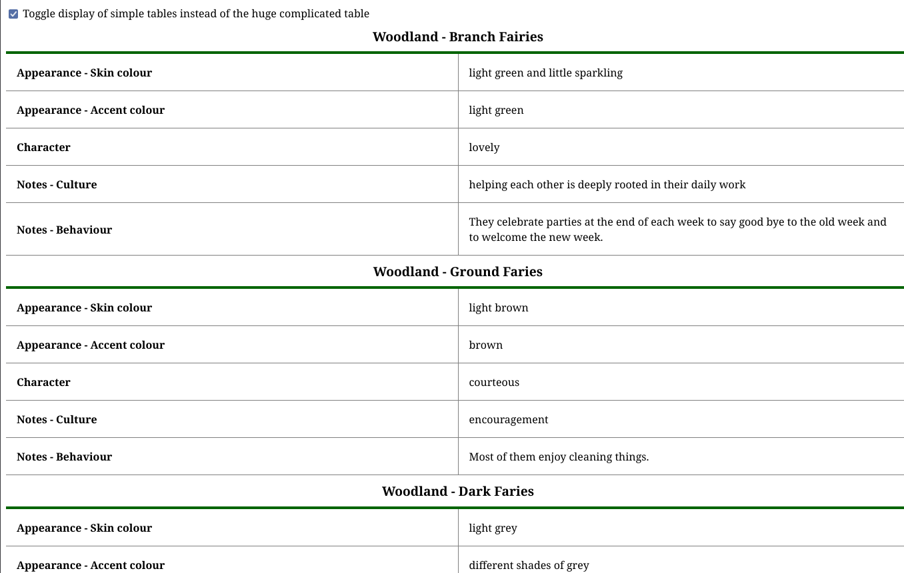

= SimplifyHTMLTable

A small javascript library to turn complicated HTML tables into easier ones. It's only dependency is https://github.com/ValorNaram/js-simplifyTable[js-simplifyTable], a general library to make tables easier to read & process.

.Complicated table showing the result of a fairy safari
image::demos/complicated-table.png[]

.Simple tables showing the result of a fairy safari

== Usage

. `npm i`
. `npm run start`

There are the following examples available:

* http://localhost:8080/ +
Shows an abstract complicated table with nested headers, cells spawning multiple columns and rows and with more than five columns. It demonstrates how the output looks when this library translates that table to simple ones.
* http://localhost:8080/fairy-safari-table +
Shows results of a safari tour through fairy world. It is a complicated table with nested headers, cells spawning multiple columns and rows and with more than five columns. It demonstrates how the output looks when this library translates that table to simple ones.
* http://localhost:8080/fairy-city-ranking +
Gives an example of how tables are used mostly: Displaying short data about an item where the item is mostly the first column. Here it is the second column. This example demonstrates the translation to simple tables when no row level header is defined: Results in simple tables without caption.
* http://localhost:8080/fairy-city-ranking-semantic +
A semantic improvement to the previous example. Here the cells under the `Name` column have the role of row level headers, the 'Name' column is the first one and the `Rank` column follows. Simple tables generated out of the complicated table have a caption.
* http://localhost:8080/freestyle +
It allows you to test the library using your own tabular data. It prompts you for the HTML code of the table you want to see transformed and with the click on a button, it renders it for you allowing to toggle between simple tables and the original.

See link:./assets/demo.js[demo.js] for example code how to use this library.